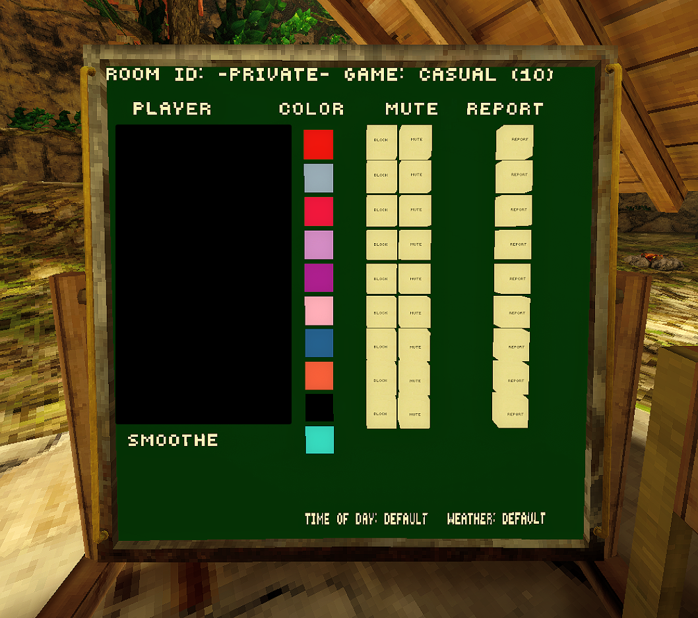

<h1 align="center">GetBlocked</h1>

  
  
  

**GetBlocked** adds a simple Block button directly to the in-game leaderboard. Blocking a player hides their gorilla, cosmetics, and nametag from your view while also muting them. Blocked players stay blocked across lobbies until you manually unblock them.

 

  

